## Week 9 - Expression Overview
Hi and welcome to the penultimate week of GSoC coding! 

This week I'm excited to show the expression overview, which I think complements the rest of the View-Only mode very well. Then I'll briefly describe what's left of this year's GSoC.

### Expression Overview
I've added an expression overview to the trust prompt. The overview lists all expressions that would be evaluated if the flow graph is trusted. This should make it easier for a user to examine if the flow graph should be trusted or not.The overview is hidden (and unpopulated) in an expander when the prompt is showed. When the user clicks the expander the overview is filled with the data and displayed to the user. 

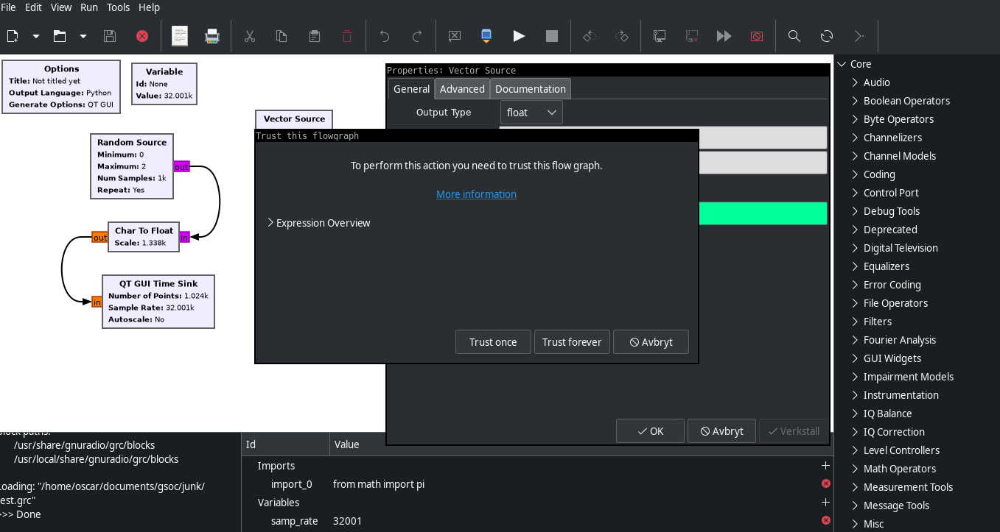
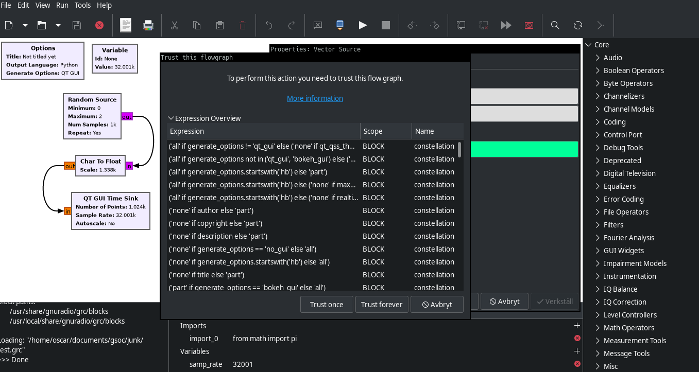

Along with the expressions the overview shows their scope (flow graph, block, parameter) and any name it's associated with. For example a parameter expression has the scope `PARAMETER` and their name is the block it belongs to, whereas the expressions found in block templates have the scope `BLOCK`

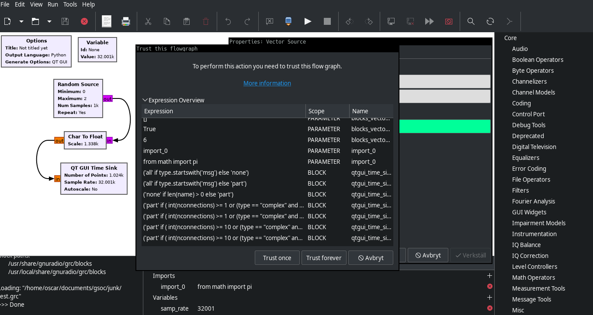

I think this is quite useful in it's current state, but there are many improvements that could be implemented. For example there are many expressions in a flow graph which are obviously harmless, such as literals. For example, in the image above there are expressions such as `6` and `True` which just clutters the overview and potentially obscures malicious expressions. Such expressions
should be filtered out beforehand by doing some parsing. Part of next week's work will be improving this overview further.

Next week is the last week of coding, then there is a week of "code submission" and evaluations followed by a week of the mentors' evaluations. So next week there will be a PR containing the "finished" work, and then there will be updates according to the reviews on the PR by the code submission part. Of course GSoC ending doesn't mean the View Only Mode is completely done, I'm looking
forward to seeing the response and thoughts of the community once it goes live and developing it further.

Happy friday!


\- Oscar

## Week 8 - GUI And More
### Link
I've added a link in the trust prompt, which in the future will lead to a wiki page about the view-only mode.

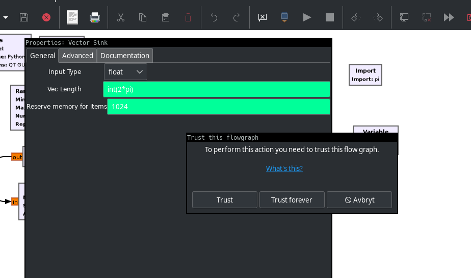

Note: the text in this prompt and any other GUI elements are currently just placeholders. I'll change it, with the input of more UX-savy people, so that everything is clear, grammatically correct etc. And then the wiki page serves as the source of additional info on the feature.

### Trusted directories
I mentioned the possible feature of trusting entire directories last week, and I've had several people express interest in the feature. So this week I added just that. In the trust manager dialog the user can click "Add directory" and then select the directory (or multiple) in a file chooser dialog. Behind the scenes the directory paths are stored in the config just like trusted grc-files. When a
flow graph is opened the GRC checks if it is trusted or is inside a trusted directory. If neither -> opened in view only mode.

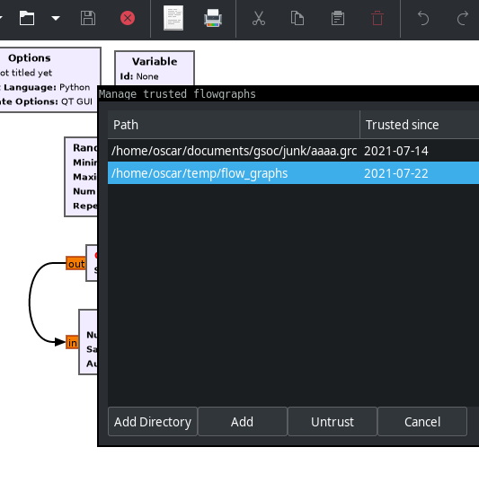

### Other
The other stuff I've done this week aren't particularly interesting, but nonetheless important for making the view-only mode robust and smooth. The trust prompt activation is now completely done, it pops up when it should (i.e. for a given set of actions and modifying parameters) and whenever the loaded grc-file is missing some of the values needed for the view only mode. The latter
scenario could occur if a user opens a file saved before the view-only-mode features had (have?) been added. Currently the user can click cancel in the prompt and view the flow graph in view-only mode even without some stored values, but it will probably display some errors on the blocks as a result of missing evaluated expressions. This behavior is not set in stone yet, as there is a balance between not showing anything at all for
incomplete grc-files (forces user to trust immediately) or showing them in a possibly error-ridden state (appears wonky in some cases and perfectly fine in others).

For the next week I will look further into the behavior of the view only mode with incomplete grc-files to get insight into what direction we'd want to pursue. I will also create the "Overview of expressions to evaluate"-dialog which I had in my initial proposal. It would be reachable from the trust prompt and provide a list of all expressions that would be evaluated if trusted. The expressions should be
sorted according to some heuristics trying to determine how "suspicious" they are, helping the user to quickly make an informed decision to trust or not.


\- Oscar


## Week 7 - Continuing on last week's work 

### Add "Add trusted"-button in trust manager
Last week I created a window where the user can manage trusted flow graphs. It had a list of the flow graphs and a button to stop trusting them. This week I have added a button to add trusted flow graphs, which should be a convenient alternative to having to open each flowgraph individually and trigger the prompt to trust it. This supports adding multiple files at once, but not trusting entire
directories. Next week I will try to add directory trusting as well, so the user could trust all files in a directory instead of having to specify the exact files.

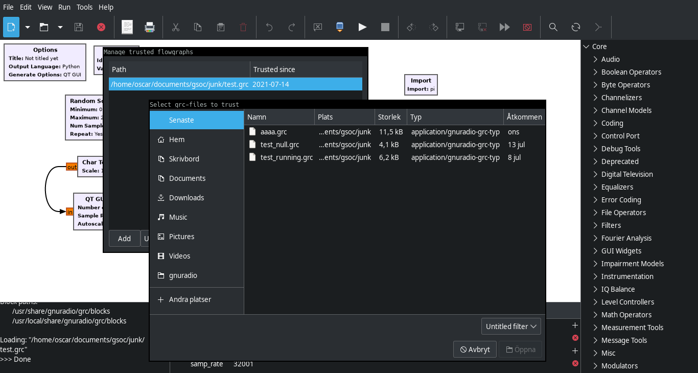

### Refining the prompt behavior
The main thing I've been working on this week is refining how and when the prompt is activated. As mentioned last week I initially activated it on flow graph update, which caused it to pop up way too often. Then I set out to activate it on TrustErrors raised from the `core` which wasn't that simple. This week I managed to get that working as well but it was cumbersome and messy.

So, after some consulting with my mentor Sebastian (Koslowski) we decided on a different approach where the Application's `handle_action`-method uses a whitelist of view-only actions. At the start of `handle_action` it checks the action against the whitelist. If it isn't a view-only action the prompt is opened, and the user can choose to trust/not trust the flow graph. If the user does **not** trust the
flow graph it is reverted to it's initial state, effectively reverting the action. 

**`grc/Application.py:handle_action`**

def _handle_action(self, action, *args):
    # ...

    non_view_only_actions = {
        Actions.FLOW_GRAPH_SAVE,
        Actions.FLOW_GRAPH_SAVE_AS,
        Actions.FLOW_GRAPH_SAVE_COPY,
        Actions.ELEMENT_CREATE,
        Actions.ELEMENT_DELETE,
        Actions.BLOCK_ENABLE,
        Actions.BLOCK_DISABLE,
        Actions.BLOCK_CREATE_HIER,
        Actions.BLOCK_PASTE,
        Actions.FLOW_GRAPH_GEN,
        Actions.FLOW_GRAPH_EXEC,
        Actions.FLOW_GRAPH_KILL
    }

    if (flow_graph and
            flow_graph.view_only and
            action in non_view_only_actions):

        # open prompt
        flow_graph.view_only = Dialogs.choose_trust(main, self.config, flow_graph.grc_file_path)

        # reset to initial state if not trusted
        if flow_graph.view_only:
            data = flow_graph.initial_state
            if data is not None:
                flow_graph.import_data(data)
                flow_graph.update()
            return

        flow_graph.update()

    if action == Actions.APPLICATION_INITIALIZE:
    # ...


This works really well as the prompt appears only when it should, and the code behind it is pretty clean. It also makes it easy to adjust which actions should be regarded as view-only or not, as it is only a matter of changing the whitelist. 

There is one action which needs different treatment though: `BLOCK_PARAM_MODIFY`. When the user modifies a block's parameter it, unlike other actions, rewrites/updates that block by itself first, before reaching the `handle_action` method. Thus it does not open the prompt when the user changes a parameter, to do that the prompt has to be opened upon focusing on the parameter-input or on keypress. That should be simple to add (famous last words!) and
will be one of the tasks for next week.

Hope you all have a nice weekend!

\-Oscar

## Week 6 - Managing trusted flow graphs
Until this week a flowgraph's trust was non-persistent, whenever the user restarted the GRC they would have to trust it again. This would get quite annoying in the long run which is why I've now added the option to trust a flowgraph indefinitely. The GRC then saves the flowgraph path to the config-file, similar to how it already keeps track of open files/recent files. 

**`~/.gnuradio/grc.conf`**
```
# This contains only GUI settings for GRC and is not meant for users to edit.
#
# GRC settings not accessible through the GUI are in config.conf under
# section [grc].

[main]
snap_to_grid = True
file_open = /home/oscar/documents/gsoc/junk/test.grc
main_window_width = 1366
main_window_height = 730
console_window_position = 513
blocks_window_position = 1136
variable_editor_position = 332
xterm_missing =
view_only_mode = True

[files_recent]

[files_open]
files_open_0 = /home/oscar/documents/gsoc/junk/test.grc

[files_trusted]
files_trusted_0 = /home/oscar/documents/gsoc/junk/test.grc
```

For the GUI this feature includes a "Trust forever" button, which internally adds the flowgraph path to the config.

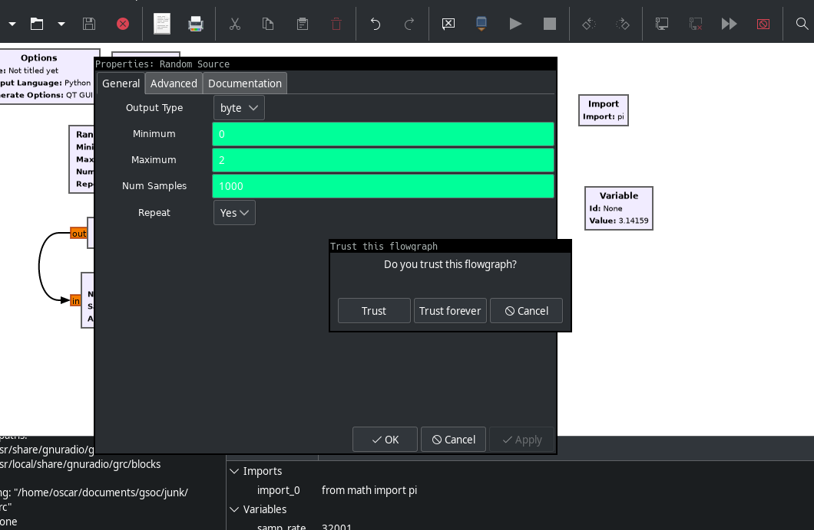

There is also a new dialog where the user can see which flowgraphs are trusted and remove trust from flowgraphs. This "trust manager" may be extended with additional features if there is time. For example one may want to trust an entire directory instead of having to trust each individual flowgraph in that directory.

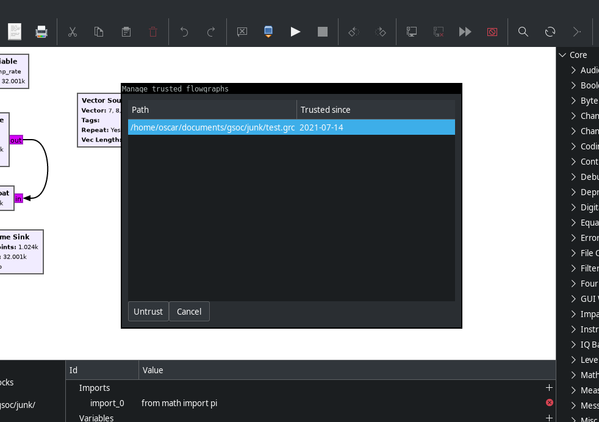

This dialog is reachable via File\>Manage Trust:

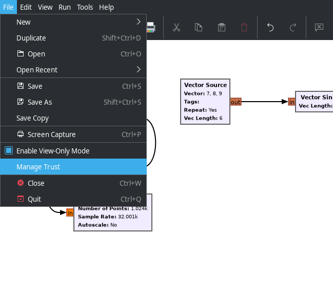

In addition to the persistent trust I've also worked on how the trust prompt is triggered. Last week I wrote about how triggering it on flowgraph update is too "coarse-grained", as the user is prompted for actions that should not require leaving the view-only mode. Therefore I've tried to trigger it on the core's TrustError instead, though this turned out to be more difficult than I had expected. Specifically I will have to invalidate the cached values of block/parameter expressions on some actions, causing it to throw a TrustError which then triggers the prompt. I'll continue working on this for the next week. I think this is the main hurdle left for a basic view-only mode, then the work will be on refining the UX as well as adding more features which would be nice to have, such as using content hashes to check if a trusted file has been changed since it's last use.

Have a nice weekend everyone!

\- Oscar

## Week 5 - Getting started with the GUI
As I mentioned last week the project is split into two parts: the core and the GUI. I made the PR for the core part this monday and have gotten some good feedback on it. I will adjust the code according to the feedback and push the changes this weekend, constituting the half time of GSoC. Naturally, there may be additional changes to the core later on if needed.

Link to PR:
<https://github.com/gnuradio/gnuradio/pull/4838>

This week I have added GUI elements for exiting the View-Only Mode. This includes a prompt which trusts the specific flowgraph and a toggle which enables/disables the View-Only Mode on a general non-flowgraph-specific level.

### Prompt
Whenever the user wants to perform some action outside of the View-Only Mode, i.e. anything that needs more than the cached values, the user will be prompted the trust the flowgraph. If the user trusts the flowgraph the View-Only Mode is disabled for that flowgraph and thus evaluation is allowed. I've made a new dialog in `grc/gui/Dialogs.py` which currently provides the options **Trust** and
**Cancel**, if the user chooses **Trust** the flowgraph is marked as trusted. Currently this is triggered in the flowgraph's `update` method, which is typically called by the action-handler `_handle_action` in `grc/gui/Application.py`. This generates many false positives, where the user is prompted for actions that don't actually require leaving the View-Only Mode. The plan is to throw a
`TrustError` in the core whenever trust is needed, e.g. due to missing cache-values, and on such error open this dialog. This also requires saving the state temporarily as this exception could be raised in the middle of an action, interrupting the "expected" control flow.

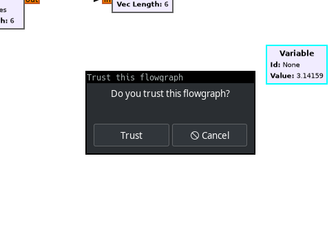

### Toggle
Some users may not want to use the View-Only Mode at all, therefore I have added a toggle button for enabling/disabling it. This is also pretty straightforward. The toggle button controls a property `view_only_mode` in the Platform class (`grc/core/Platform.py`), if it's False any flowgraphs created will be regarded as trusted, meaning they are unaffected by the View-Only Mode.
Alongside this setting there will be some more settings for trust, allowing the user to edit the trust-list (containing which flowgraphs are permanently trusted).

```Python
def _handle_action(self, action, *args):
    log.debug("_handle_action({0}, {1})".format(action, args))
    main = self.main_window

    # ...

    ##################################################
    # Initialize/Quit
    ##################################################
    if action == Actions.APPLICATION_INITIALIZE:
        log.debug("APPLICATION_INITIALIZE")

        # View Only Mode
        act = Actions.TOGGLE_VIEW_ONLY_MODE
        act.set_enabled(True)
        if hasattr(act, 'load_from_preferences'):
            act.load_from_preferences()

        if not act.get_active():
            self.platform.view_only_mode = False

    # ...

```

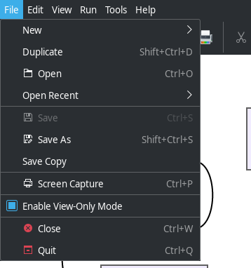

That's it for this week's update! Next week I will continue with the GUI, connecting the trust prompt to the TrustError and extending the trust system with more GUI.

\- Oscar

## Week 4 - Testing with Python's audit-feature and PR
This week's focus has been on refining the core-parts of the View-Only Mode for the upcoming PR (more on that below) as well as adding a test that checks there are no evals/execs being run in untrusted flowgraphs.

### Test
I've previously written about the [Python 3.8 Audit feature](https://www.python.org/dev/peps/pep-0578/) which allows the developer to add a hook that will be called whenever an event is audited. One such event is the `exec` event which includes the `eval` and `exec` functions. This allows us to check for any evals in runtime, which we can use to make sure the View-Only mode is working.

```Python
def audit(event, args):
    if event == 'exec':
        print("There is eval!")

sys.addaudithook(audit)
```

Though, this provides many false-positives due to legitimate evals outside of the grc, such as in libraries. Therefore there must also be some filtering of the events, such as filtering out anything that isn't in the grc. While the actual code object executed is accessible through the `args` parameter it does not provide us the filename from which it was called (it provides file: "<string>"). Therefore we can use the `inspect` module part of the standard library to inspect the stack and thus determine where the event comes from.

The resulting test case looks something like this:

```Python
import inspect
# ...

EVALUATED = False
EVALUATED_PATH = None

def audit(event, args):
    global EVALUATED, EVALUATED_PATH

    if event == 'exec':
        stack = inspect.stack()
        path = stack[1].filename

        if "/grc/core" in path:
            EVALUATED = True
            EVALUATED_PATH = path

def open_flowgraph(path):
    # ...

@pytest.mark.skipif(sys.version_info < (3,8), reason="requires python 3.8")
def test_eval():
    global EVALUATED, EVALUATED_PATH

    sys.addaudithook(audit)

    flowgraph_path = path.join(path.dirname(__file__), 'resources', 'test_eval.grc')
    open_flowgraph(flowgraph_path)

    assert not EVALUATED, f"untrusted evaluation in {EVALUATED_PATH}"
```

### PR
The plan is to divide the work into two pull requests. The first one will contain the backend logic of the View-Only Mode (mainly in `grc/core`) whereas the second contains the GUI/UX parts. I will make the first PR this weekend and begin working on the second stage of the project next week. This means working on features such as:
- Checkbox setting for activating View-Only Mode
- Prompt for enabling trust in a FlowGraph
- More advanced trust settings, handling persistent trust
- If time: Overview of expressions to be executed if trusted

\- Oscar

## Week 3 - Block and FlowGraph level eval 

Last week I disabled parameter level evaluation for untrusted flowgraphs, using the evaluated values I've stored in the .grc-files instead. This week I've extended this further by also disabling evaluation on block level as well as flowgraph level.

For the block level evaluation there are two parts, expressions in the block templates as well as import-blocks. The GRC core uses `exec` to run the imports which updates the namespace. Though, this could be exploited to have the GRC run some malicious code and thus need to be disabled for the View-Only Mode. Similarly the templates contain expressions that also could contain malicious code.
See line **25** in the following template (`grc/blocks/pad_source.block.yml`) for an example of a (benign) expression:

```
 1 id: pad_source
 2 label: Pad Source
 3 flags: [ python, cpp ]
 4
 5 parameters:
 6 -   id: label
 7     label: Label
20     ...
21 -   id: vlen
22     label: Vector Length
23     dtype: int
24     default: '1'
25     hide: ${ 'part' if vlen == 1 else 'none' }
26 -   id: num_streams
27     ...
```

These expressions are evaluated using the block's `evaluate` method which before my changes just called the parent flowgraph's evaluate with the block's namespace. I've changed the method to, in a trusted flowgraph, save all expression-evaluation pairs in a dictionary `_eval_cache` which is then used when exporting the block data. For an untrusted flowgraph the block fetches the evaluated expressions from the file with the `import_data` method and `evaluate` then simply returns the stored value.

```Python
def evaluate(self, expr):
    if self.parent_flowgraph.is_trusted:
        self._eval_cache[expr] = self.parent_flowgraph.evaluate(expr, self.namespace)

    evaluated = self._eval_cache.get(expr)

    if evaluated is None:
        # error

    return evaluated

def export_data(self):
    """
    Export this block's params to nested data.

    Returns:
        a nested data odict
    """
    data = collections.OrderedDict()

    # ...

    data['expressions'] = collections.OrderedDict(sorted(
        (expr, val) for expr, val in self._eval_cache.items()
    ))

    return data
```

As for the import blocks the `exec` is only executed if the flowgraph isn't trusted, otherwise it is ignored. For the imports this is sufficient as the View-Only Mode removes the other evaling where the updated namespace provided by the import would have been needed.

```Python
def rewrite(self):
    # ...
    
    if self.parent_flowgraph.is_trusted:
        exec(imports, self.block_namespace)

    # ...
```

Similarly the FlowGraph's rewrite method (`grc/core/FlowGraph.py`) is altered to not perform `renew_namespace` unless trusted. This stops the execs and evals done on the flowgraph level (such as imports):

```Python
def rewrite(self):
    """
    Flag the namespace to be renewed.
    """
    if self.is_trusted:
        self.renew_namespace()
    Element.rewrite(self)

def renew_namespace(self):
    namespace = {}
    # Load imports
    for expr in self.imports():
        try:
            exec(expr, namespace)
        except ImportError:
            # We do not have a good way right now to determine if an import is for a
            # hier block, these imports will fail as they are not in the search path
            # this is ok behavior, unfortunately we could be hiding other import bugs
            pass
        except Exception:
            log.exception('Failed to evaluate import expression "{0}"'.format(expr), exc_info=True)
            pass

    self.imported_names = list(namespace.keys())

    # ...
```

The next week's work will focus on refining this further, adding a trigger for when the trust-level should change from untrusted to trusted (later in form of a GUI prompt), as well as writing a test using the Python audit features to make sure evals/execs are disabled as they should.

\- Oscar

## Week 2 - Using the saved values instead of evaluating
This week I have improved the exporting of evaluated values that I implemented last week as well as started working on actually using these values when loading the grc-file.

### Exporting non-primitives
As mentioned last week PyYAML can dump primitive types directly without problems wheras non-primitives such as [Constellations](https://wiki.gnuradio.org/index.php/Constellation_Object) needs to be represented as a string before being dumped. This is implemented using a type whitelist which determines how a parameter is represented depending on its type. If it is primitive it is
represented with it's evaluated value wheras non-primitives are represented using the parameter's pretty\_print-method (moved from `grc/gui/canvas/param.py` to `grc/core/param.py)

```Python
def export_data(self):
    data = collections.OrderedDict()

    # ...

    # whitelist of types accepted by YAML
    yaml_types = PARAM_TYPE_NAMES - {'raw'}

    def get_param_repr(param):
        if param.dtype in yaml_types:
            return param.get_evaluated()
        else:
            return param.pretty_print()

    data['evaluated'] = collections.OrderedDict(sorted(
        (param_id, get_param_repr(param)) for param_id, param in self.params.items()
        if (param_id != 'id' or self.key == 'options')
    ))

    return data
```

### Using the evaluated values
As mentioned I've started limiting the parameter evaluation, using the stored value instead. This is done on a parameter level by adding a field containing the saved value in the `Param` class and initializing it in the block's `import\_data` method. The param's evaluate-method is modified to use the saved value if the flowgraph isn't trusted, and continue with the evaluation if it is. The saved value is stored in a separate field than `\_evaluated` as `\_evaluated` is reset during rewrites of the graph/params.

Currently the trust setting is hardcoded in the flowgraph but a more extensive and GUI-accessible trust system will be implemented later in the project.

```
def evaluate(self):
    """
    Evaluate the value.

    Returns:
        evaluated type
    """
    self._init = True
    self._lisitify_flag = False
    self._stringify_flag = False
    dtype = self.dtype
    expr = self.get_value()
    scale_factor = self.scale_factor

    if not self.parent_flowgraph.is_trusted:
        self._evaluated = self._saved_evaluated
        return self.get_saved_evaluated()

    # some evaluation...
```

This stops parameter evaluation which is a good start but not complete. In addition to this there are import-blocks which are executed as well as expressions in the block templates which are evaluated. The next week's work will be to disable these as well.

### About the View-Only Mode
Looking ahead in the project, when the core-work is done, the project will shift into GUI and UX work. The main features of the UX are:
- a trust-dialog asking if the user trusts the flowgraph
- an error dialog for whenever something goes wrong, specifically when the stored values are not enough to display the graph without some evaluation

and if time permits:
- a dialog showing the expressions that will be run if the user chooses to trust the file. This could possibly be enhanced with heuristics trying to guess which expressions may be of special interest and highlight these.

For more details you can read my [project proposal](https://docs.google.com/document/d/1dL6PziJSopcY3O7gJ6CXiedTSdbhrHVFhR-UJRTmsng).

That is it for now. Thanks for reading and please reach out if you have any questions!

\- Oscar

PS: Interestingly enoguh VS Code recently launched a [feature which allows a user to trust a folder/files to enable features that may automatically execute code in the folder/file](https://code.visualstudio.com/updates/v1_57#_workspace-trust)

## Week 1 - Exporting evaluated values
To start off I want to thank everyone in the community for the warm welcome. It is reassuring to hear how much support there is!

I will be posting an update on here every friday of GSoC and any code I write can be viewed in my fork:
https://github.com/oscekh/gnuradio/tree/feature/grc-view-only-mode

For the first week of coding I am working on saving the evaluated block parameters in the .grc-files alongside the previously saved data, such as parameter expressions. The purpose of this is to make the GRC display an opened flowgraph using the saved values initially instead of evaluating possibly harmful Python expressions.

The resulting piece of code is very simple so far, currently the [block's export_data method](https://github.com/oscekh/gnuradio/blob/feature/grc-view-only-mode/grc/core/blocks/block.py#L634) is modified to fetch the parameter objects' evaluated values and pass them along in the exported data dictionary. See:

```Python
    def export_data(self):
        """
        Export this block's params to nested data.
        Returns:
            a nested data odict
        """
        data = collections.OrderedDict()
        if self.key != 'options':
            data['name'] = self.name
            data['id'] = self.key

        data['parameters'] = collections.OrderedDict(sorted(
            (param_id, param.value) for param_id, param in self.params.items()
            if (param_id != 'id' or self.key == 'options')
        ))

        data['states'] = collections.OrderedDict(sorted(self.states.items()))

        data['evaluated'] = collections.OrderedDict(sorted(
            (param_id, param.get_evaluated()) for param_id, param in self.params.items()
            if (param_id != 'id' or self.key == 'options')
        ))

        return data
```

This code relies on PyYAML knowing how to deal with whatever value is returned by `param.get_evaluated()` which results in little code working well for primitive types such as ints, strings, and lists, but likely not as well for custom types such as [Constellations](https://wiki.gnuradio.org/index.php/Constellation_Object). Thus, the exportation will need further work and testing for such
cases. Currently the plan is to implement some sort of type-whitelist which determines how types are stored (i.e. using yamls representation or a string representation etc).

This continuation will also go hand in hand with the next step, which is reading the values and using them instead of evaluating the expressions. That will also get somewhat tricky due to how the different types are handled differently and as it is not obvious how to prevent the evaluation elegantly.

To aid my debugging and tracing of the evaluation control flow I am trying out the [Python 3.8 Audit feature](https://www.python.org/dev/peps/pep-0578/) with an audit hook on the `exec` event, as well as using general logging. Though, the auditing is only for development purposes, otherwise it would require upping the minimum python version supported by GNU Radio.

```Python
def audit(event, args):
    if event == 'exec':
        # args is the code object
        log.debug("evaluating", args)
```


For the next few weeks the work will be more intricate and I will have more interesting technical details to share in my updates here. Feel free to reach out if you have any questions or feedback!

\- Oscar


## GSoC'21 Blog - Implementing a View-Only Mode in the GnuRadio Companion (GRC)

Welcome to my blog, here I will provide weekly progress updates on my work on the GRC for Google Summer of Code.

Coding will begin on June 7th, the period before that is for community bonding and getting comfortable with the codebase to get ready for coding. This includes studying the code base, solving smaller issues and discussing with the mentors.

\- Oscar Ekholm
